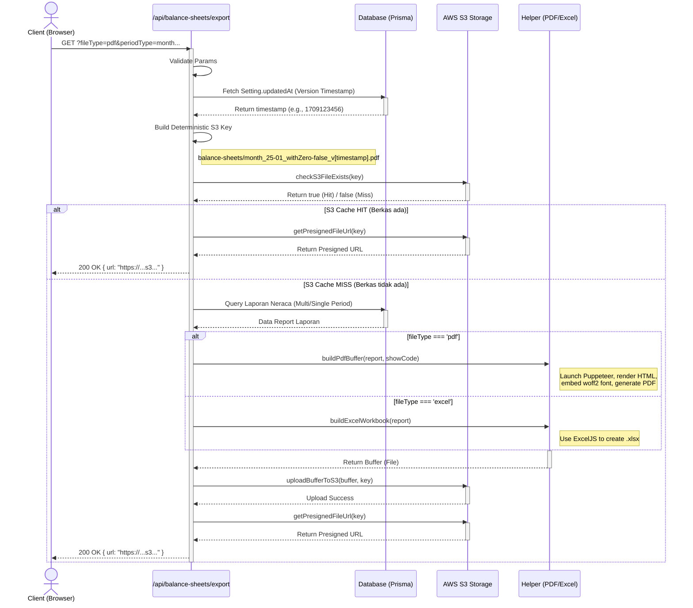

# Dokumentasi Export PDF dan Excel

Sistem ekspor pada RSI Accounting memungkinkan pengguna untuk mengekspor Laporan Neraca (Balance Sheet) ke dalam dua format dokumen: **Excel (.xlsx)** dan **PDF (.pdf)**.

Untuk memastikan performa sistem tetap optimal dan responsif—terutama ketika menghasilkan laporan multi-periode yang padat komputasi—sistem ini menerapkan strategi **Caching S3 Berbasis Versi (Version-based S3 Caching)**.

---

## 🏗️ Alur Ekspor & Diagram Sistem

Berikut adalah alur logika (diagram) yang terjadi di dalam proses ekspor:

---

## ⚡ Bagaimana Sistem Caching Bekerja?

Kinerja dan akurasi file cache adalah hal vital dalam proses akuntansi. Skema Caching S3 yang kita gunakan memanfaatkan sifat _deterministic_ dari URL Key S3:

### 1. Versioning (_Cache Invalidation_)

Parameter pembeda utama kapan sebuah file cache dinyatakan basi (kadaluwarsa/invalid) adalah menggunakan nilai `Setting.updatedAt` yang berfungsi sebagai **Version Token**.
RSI Accounting memastikan jika ada transaksi kotor secara global atau cutoff yang berubah, `updatedAt` sistem/tabel referensi akan berubah. Begitu timestamp berubah, sistem akan secara otomatis membuat `key` yang baru untuk _next request_. File yang lama tetap berada di S3 secara _orphaned_ (atau bisa diset aturan Lifecycle S3 untuk _auto-delete_).

### 2. S3 Naming Convention (URL Key)

Sistem merakit kunci S3 yang unik berdasarkan parameter yang diminta dan token versi. Format S3 Key yang dihasilkan:
\`\`\`
balance-sheets/{periodType}_{fromPart}\_to_{toPart}\_withZero-{withZero}\_v{version}.{ext}
\`\`\`
_Contoh Real:_
\`\`\`
balance-sheets/month_2025-11_to_2025-12_withZero-false_v1709123456.pdf
\`\`\`

Jika client meminta rentang, periode, tipe file, opsi filter zero (`withZero`), dan _timestamp version_ yang sama persis secara berturut-turut, maka Key akan selalu sama dan API langsung melompat mengembalikan `presigned URL` tanpa harus melakukan _query_ database berat dan generasi Puppeteer/Excel.

---

## 📄 Ringkasan Engine Export

### Ekspor Excel

- Menggunakan pustaka [`exceljs`](https://github.com/exceljs/exceljs).
- Menyusun barisan struktur grup akuntansi dalam format flat-tree.
- Merender sel dengan _numeric formatting_ yang dikalkulasi akurat yang kompatibel dengan program MS Excel.

### Ekspor PDF

- Menggunakan pustaka [`puppeteer`](https://pptr.dev/).
- Di-mount menggunakan image OS di dalam `Dockerfile` (Alpine Chromium, Harfbuzz, dll) yang disesuaikan path variabel lingkungannya.
- Merakit dokumen dengan string HTML raksasa yang berisi komponen CSS inline persis dengan tampilan `BalanceSheetView` komponen UI.
- Lebar (Width) _dynamic width mapping_ yang dimodifikasi mengikuti rumus kolom (`350px dasar + 150px rentang setiap periode + margins`), untuk menanggulangi jika rentang bulan melewati batas kertas A4.
- _Embedding_ lokal base64 font `inter.woff2` ke internal HTML `@font-face` untuk presisi rendering tipografi tanpa bergantung _web server/internet call_.
